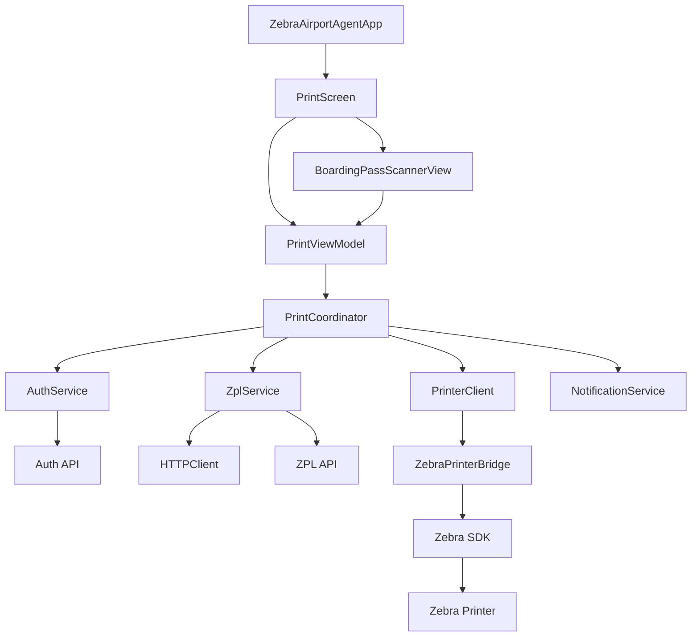
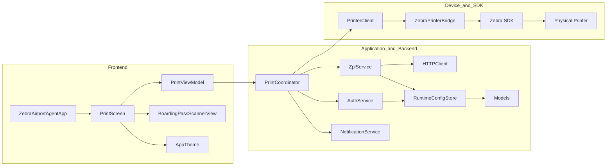
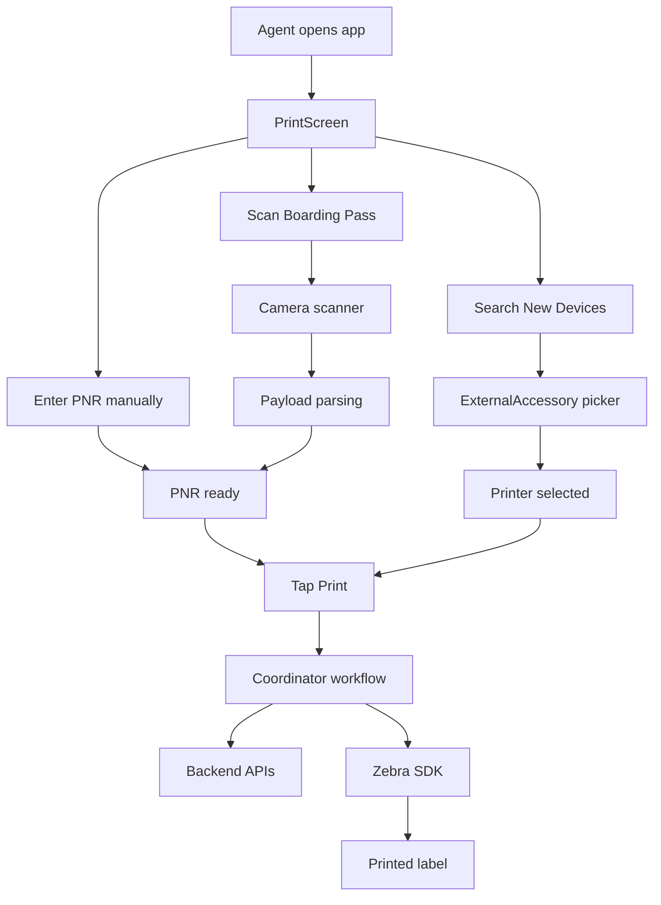
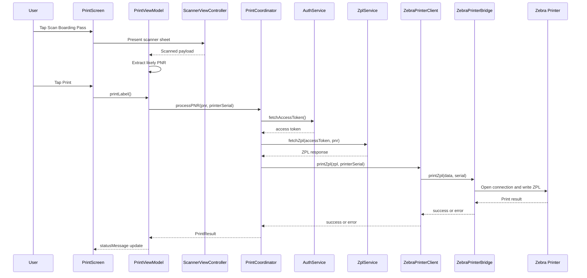
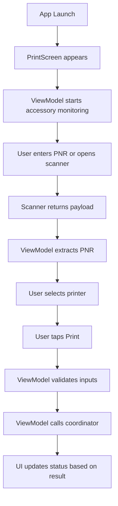
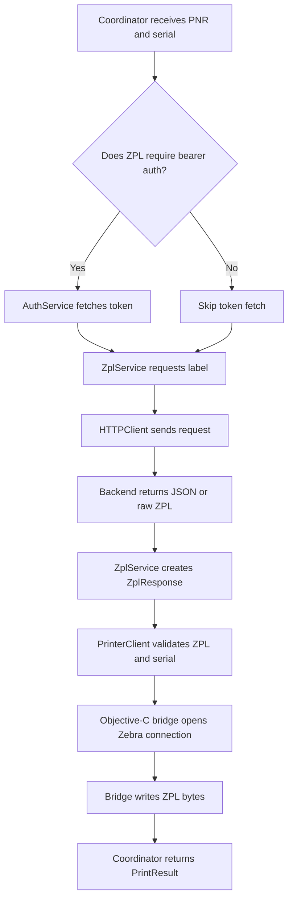

# Zebra Airport Agent Tool: Complete Implementation Guide and Swift Learning Notes

## Purpose of This Document

This guide explains the complete implementation of the app and uses the codebase itself to teach Swift in a practical way. The goal is not just to explain what each file does, but to show how a professional Swift iOS application is structured when it has:

- a SwiftUI frontend
- a view model layer for UI state and actions
- a backend-facing service layer for APIs
- a hardware integration layer for Zebra printers
- UIKit bridging where SwiftUI alone is not enough

If you study this document together with the code, you will understand both the app and the professional development patterns behind it.

## What This App Does

At a high level, the app lets an airport agent:

1. discover a Zebra printer
2. scan a boarding pass or type a PNR manually
3. call backend services to get printable ZPL data
4. send the ZPL to the Zebra printer over the Zebra SDK
5. show status in the UI and local notifications

## The Big Separation: Frontend vs Backend

In this app, frontend and backend are not about separate servers inside the repository. They are separate responsibilities inside the iOS app.

### Frontend Responsibilities

The frontend is everything related to what the user sees and touches:

- screen layout
- buttons, text fields, sheet presentation
- barcode scanning UI
- printer selection UI
- loading states and status messages

Main frontend files:

- [App/PrintScreen.swift](App/PrintScreen.swift)
- [App/PrintViewModel.swift](App/PrintViewModel.swift)
- [App/BoardingPassScannerView.swift](App/BoardingPassScannerView.swift)
- [App/ZebraAirportAgentApp.swift](App/ZebraAirportAgentApp.swift)
- [AppCore/UI/AppTheme.swift](AppCore/UI/AppTheme.swift)

### Backend Responsibilities

The backend process in this app means all logic that talks to external systems or device layers:

- authentication API
- ZPL generation API
- request building and response parsing
- configuration loading
- printer communication
- notification delivery
- orchestration of the whole print workflow

Main backend and device files:

- [AppCore/PrintCoordinator.swift](AppCore/PrintCoordinator.swift)
- [AppCore/API/AuthService.swift](AppCore/API/AuthService.swift)
- [AppCore/API/ZplService.swift](AppCore/API/ZplService.swift)
- [AppCore/API/HTTPClient.swift](AppCore/API/HTTPClient.swift)
- [AppCore/API/RuntimeConfigStore.swift](AppCore/API/RuntimeConfigStore.swift)
- [AppCore/Zebra/PrinterClient.swift](AppCore/Zebra/PrinterClient.swift)
- [App/ZebraPrinterBridge.m](App/ZebraPrinterBridge.m)
- [App/ZebraPrinterBridge.h](App/ZebraPrinterBridge.h)
- [AppCore/Notifications/NotificationService.swift](AppCore/Notifications/NotificationService.swift)
- [AppCore/Models.swift](AppCore/Models.swift)

## Architecture Overview



## Visual Map

This section is designed for fast orientation when you open the repo for the first time.

### Layer Ownership Diagram



### Screen-to-System Map



### Suggested Real Screenshot Set

If you want to turn this into onboarding material for other engineers or airport agents, these are the best screenshots to capture from the running app:

1. main print screen before device discovery
2. Bluetooth printer selection state after discovery
3. scanner sheet with barcode guide overlay
4. populated PNR after successful scan
5. printing state with progress indicator
6. success state showing printed job feedback
7. failure state showing a realistic operational error

### Screenshot Annotation Template

Use this template under each screenshot if you add PNGs later:

```md
#### Screen: Main print form

What the user is doing:
- Selecting printer
- Entering or scanning a PNR

What the code path is:
- PrintScreen renders controls
- PrintViewModel owns form state
- PrintCoordinator starts only after Print is tapped

What to learn from it:
- SwiftUI binds UI directly to observable state
```

## End-to-End Runtime Flow



## Frontend Implementation

## 1. App Entry Point

The application starts in [App/ZebraAirportAgentApp.swift](App/ZebraAirportAgentApp.swift).

This file uses the SwiftUI App lifecycle:

```swift
@main
struct ZebraAirportAgentApp: App
```

### What this teaches you about Swift

- Structs are commonly used in SwiftUI for views and app declarations.
- The App protocol is the root entry point for modern SwiftUI apps.
- The body property returns a Scene, usually a WindowGroup.
- Initialization can be used to bootstrap theme, fonts, and startup side effects.

### What happens here

- theme and fonts are initialized through AppTheme
- notification permission is requested asynchronously
- the root screen is PrintScreen

Professionally, this is good because the app entry point stays thin. It delegates actual business logic elsewhere.

## 2. Main Screen

The primary user interface lives in [App/PrintScreen.swift](App/PrintScreen.swift).

This is a SwiftUI View. It is responsible for layout and user interaction, not business logic.

### Core Swift concepts here

#### StateObject

```swift
@StateObject private var viewModel: PrintViewModel
```

Use StateObject when the view owns the lifecycle of an observable object. That means this screen creates and keeps the same view model instance while the view lives.

#### Declarative UI

SwiftUI is declarative. Instead of saying:

- create button
- attach handler
- manually refresh label

you describe what the UI should look like for the current state.

Examples from this screen:

- if there are no connected devices, show helper text
- if printing is in progress, show ProgressView
- if scanner is presented, show a sheet
- button disabled state follows view model flags

### UI responsibilities in this file

- printer discovery buttons
- picker for connected Zebra printers
- text field for PNR
- button to launch boarding pass scanner
- text field for printer serial number
- print button
- status text for user feedback

### Why this is professional

- the view does not build URLs, parse JSON, or talk directly to Zebra SDK
- UI actions call methods on the view model
- logic is separated from presentation

That separation is one of the most important habits for becoming strong in SwiftUI.

## 3. View Model

The UI state and action logic live in [App/PrintViewModel.swift](App/PrintViewModel.swift).

This file is the best place to learn how a professional SwiftUI app organizes state.

### Important Swift concepts in this file

#### ObservableObject and Published

```swift
@MainActor
final class PrintViewModel: ObservableObject
```

and fields like:

```swift
@Published var pnr: String = ""
@Published var isPrinting: Bool = false
@Published var statusMessage: String = "Ready"
```

What this means:

- ObservableObject is a reference type that can notify SwiftUI when state changes.
- Published marks properties that should trigger UI refreshes.
- MainActor ensures UI-related state changes happen on the main thread.

This is a major professional pattern: isolate mutable screen state in a dedicated view model.

#### final class

The class is marked final. That means it cannot be subclassed. In Swift, final often communicates design intent and can help performance.

#### Dependency injection

```swift
private let coordinatorFactory: () throws -> PrintCoordinator
```

Instead of hard-coding object creation everywhere, the view model accepts a factory. This is useful for testing and keeps construction separate from behavior.

This is one of the habits that separates beginner code from maintainable production code.

### UI State Managed Here

The view model owns:

- entered PNR
- selected printer serial
- connected device list
- whether the app is searching for printers
- whether a print is in progress
- current status message

### Action Logic Managed Here

The view model does four important jobs.

#### A. Parse scanned boarding pass payloads

Method:

- applyScannedPayload

This takes the raw barcode content, cleans it, and tries to extract a likely PNR.

Two approaches are used:

1. fixed-position extraction for IATA BCBP format
2. regex-based fallback and scoring heuristics for other payloads

This is good real-world engineering because production barcode data is often inconsistent.

#### B. Monitor connected Zebra accessories

Methods:

- startAccessoryMonitoringIfNeeded
- refreshConnectedDevices

The app uses ExternalAccessory and Combine to react to device connect and disconnect events.

This teaches two useful patterns:

- iOS framework integration
- event subscription with Combine publishers

#### C. Search for printers

Method:

- searchForNewDevices

This calls the native iOS Bluetooth accessory picker and then refreshes the list of discovered printers.

It also maps platform-specific error codes into user-friendly status messages. That is an important professional skill: translate system errors into operational guidance.

#### D. Start the print flow

Method:

- printLabel

This is the frontend handoff point into the backend flow.

What it does:

1. trims and validates PNR and serial
2. flips loading state on
3. creates the coordinator
4. calls the coordinator asynchronously
5. maps the result into user-readable status text
6. flips loading state off

This is exactly the kind of screen action flow you will build in many real iOS apps.

## 4. Scanner Bridge: SwiftUI to UIKit

The scanner implementation lives in [App/BoardingPassScannerView.swift](App/BoardingPassScannerView.swift).

This file is very important if you want to become strong in iOS development, because many production apps combine SwiftUI and UIKit.

### Why UIKit is used here

SwiftUI does not directly expose all lower-level camera scanning APIs in a simple native component. So the app uses:

- UIViewControllerRepresentable to wrap UIKit
- AVCaptureSession for camera input
- AVCaptureMetadataOutput for barcode detection

### Core Swift pattern

```swift
struct BoardingPassScannerView: UIViewControllerRepresentable
```

This protocol is how you embed a UIKit controller inside SwiftUI.

The required pieces are:

- makeUIViewController
- updateUIViewController
- a Coordinator if delegate callbacks are needed

### Why Coordinator exists

UIKit APIs often use delegates. SwiftUI prefers closures and state. The coordinator acts as the adapter between those two worlds.

In this file:

- ScannerViewController does the camera work
- ScannerViewControllerDelegate defines callbacks
- Coordinator receives delegate events
- closures send results back to the SwiftUI layer

That is a classic bridge pattern.

### What ScannerViewController does

This UIKit controller handles:

- camera authorization
- capture session setup
- preview layer
- barcode metadata detection
- guide overlay drawing
- prioritization of barcode formats
- stopping after one valid capture

### What this teaches you about professional iOS work

- permission handling must be explicit
- camera setup can fail and should surface clear errors
- overlay UI can be built in UIKit even inside a SwiftUI app
- scanning should stop once a valid code is captured to avoid duplicate actions

## Backend and Device Implementation

## 5. The Coordinator Pattern

The center of the backend flow is [AppCore/PrintCoordinator.swift](AppCore/PrintCoordinator.swift).

This is the orchestration layer. It does not care about buttons or layout. It cares about process order.

### Why coordinators are useful

Without a coordinator, your view model can become bloated with:

- authentication logic
- API logic
- print logic
- notification logic

By moving workflow steps into a coordinator, the codebase becomes easier to test and easier to reason about.

### What processPNR does

The method:

```swift
func processPNR(pnr: String, printerSerial: String, stationCode: String? = nil, deviceId: String? = nil) async -> PrintResult
```

Its job is:

1. decide whether bearer auth is required
2. fetch a token if needed
3. fetch ZPL from backend using the PNR
4. send ZPL to the printer
5. show success notification
6. return a PrintResult
7. catch any failure and convert it into a failed PrintResult

### Why this is good architecture

- the order of operations is obvious
- dependencies are injected in the initializer
- errors are centralized
- the UI gets one result object instead of managing each subsystem directly

This is an example of clean application flow design.

## 6. Models and Error Types

Shared models live in [AppCore/Models.swift](AppCore/Models.swift).

This file teaches several core Swift patterns.

### Codable models

Examples:

- RuntimeConfig
- TokenResponse
- ZplRequest
- ZplResponse

Swift uses Codable to encode and decode JSON with minimal boilerplate.

Example idea:

- Encodable turns a Swift type into JSON
- Decodable turns JSON into a Swift type
- Codable means both

### Enums

```swift
enum PrintStatus: String {
    case accepted
    case printed
    case failed
}
```

Enums are central to strong Swift code. They constrain valid states and make intent clearer than raw strings scattered across the app.

### Error modeling

```swift
enum AppError: Error, LocalizedError
```

This is good practice because:

- it centralizes app-specific failures
- it allows user-readable messages
- it avoids leaking low-level errors directly into UI code

If you want to write professional Swift, learn to model errors intentionally.

## 7. Configuration Loading

Runtime configuration begins in [AppCore/Models.swift](AppCore/Models.swift) with RuntimeConfig.loadFromBundle and continues in [AppCore/API/RuntimeConfigStore.swift](AppCore/API/RuntimeConfigStore.swift).

The bundled configuration file is:

- [Config/runtime-config.json](Config/runtime-config.json)

The sample file is:

- [Config/runtime-config.sample.json](Config/runtime-config.sample.json)

### What the config system does

- loads default values from the app bundle
- allows a small number of values to be overridden through UserDefaults
- returns one merged configuration object

### Why this matters professionally

Production apps need environments and runtime configurability. Hard-coding all endpoints inside service classes is not scalable.

The config object holds:

- auth URLs and paths
- auth method and headers
- auth body template
- ZPL endpoint info
- default station and device values
- timeout configuration

This is the beginning of environment-aware app design.

## 8. Authentication Service

The auth logic is in [AppCore/API/AuthService.swift](AppCore/API/AuthService.swift).

### What it does

1. builds the auth URL from config
2. prepares a URLRequest
3. applies headers
4. encodes the request body as either form-urlencoded or JSON
5. sends the request using URLSession
6. validates the HTTP response
7. decodes the token JSON into TokenResponse
8. returns the access token string

### Swift lessons from this file

#### URLRequest building

Swift network code often starts with URLRequest. You set:

- URL
- HTTP method
- headers
- body
- timeout

#### URLSession with async await

```swift
let (data, response) = try await URLSession.shared.data(for: request)
```

This is modern Swift networking. It is cleaner than older completion-handler style code.

#### Defensive parsing

The service checks:

- was the response actually HTTP
- was the status code successful
- did the JSON decode correctly
- did the API return a non-empty token

This is what robust production service code looks like.

#### Helper functions

The private methods for form encoding and percent encoding keep the public method focused. That is a good habit.

## 9. HTTP Client Abstraction

Reusable HTTP transport logic lives in [AppCore/API/HTTPClient.swift](AppCore/API/HTTPClient.swift).

### Why this file exists

If every service builds and sends requests in its own custom way, duplication grows quickly. A shared HTTP client centralizes common behavior.

### Generic programming example

```swift
func send<Request: Encodable, Response: Decodable>(...)
```

This is a generic function. It means:

- request body can be any Encodable type
- response can be any Decodable type

This is one of the most useful intermediate Swift features to learn.

### What this abstraction gives you

- uniform request sending
- common status code validation
- common request body encoding
- shared error formatting

This is a strong example of writing reusable Swift, not just app-specific Swift.

## 10. ZPL Service

The service that fetches label data lives in [AppCore/API/ZplService.swift](AppCore/API/ZplService.swift).

### What it does

1. builds the ZPL API URL
2. copies base headers from config
3. injects Authorization header if bearer auth is required
4. creates a ZplRequest with the PNR
5. sends the request through HTTPClient
6. tries to decode structured ZplResponse JSON
7. falls back to treating the raw body as plain ZPL text

### Why this is a good design

The fallback behavior is practical. Some backends return:

- JSON with jobId and zpl

while others may return:

- raw ZPL text only

Supporting both without changing the rest of the app makes this service resilient.

That kind of tolerance for backend inconsistency is often necessary in real enterprise apps.

## 11. Notification Service

Notifications live in [AppCore/Notifications/NotificationService.swift](AppCore/Notifications/NotificationService.swift).

### What it does

- requests notification permissions
- creates a local notification with title and body
- submits it to UNUserNotificationCenter

### Why this is separated out

The coordinator should not know notification framework details. By wrapping that in a service, the orchestration layer stays cleaner.

This is another example of single responsibility.

## 12. Printer Client Abstraction

The printer-facing Swift layer is [AppCore/Zebra/PrinterClient.swift](AppCore/Zebra/PrinterClient.swift).

### Important concept: protocol-oriented design

```swift
protocol PrinterClient {
    func printZpl(_ zpl: String, printerSerial: String) async throws
}
```

This protocol allows the app to depend on an abstraction instead of a concrete implementation.

That gives you options later:

- a mock printer client for tests
- a simulator printer client
- a network printer client
- a Zebra-specific implementation

### ZebraPrinterClient responsibilities

- validate non-empty ZPL
- validate serial number
- convert ZPL string into UTF-8 data
- call the Objective-C bridge
- map failures into AppError.printing

This is the right place for Swift-side printer validation.

## 13. Objective-C Bridge to Zebra SDK

The hardware bridge is implemented in:

- [App/ZebraPrinterBridge.h](App/ZebraPrinterBridge.h)
- [App/ZebraPrinterBridge.m](App/ZebraPrinterBridge.m)

This is one of the most valuable parts of the project for learning professional iOS development.

### Why Objective-C is here

Some SDKs, especially older or vendor-provided iOS SDKs, are Objective-C based. Swift can use them through bridging.

### What the bridge does

1. checks whether the Zebra SDK header is available
2. creates an MfiBtPrinterConnection using the printer serial
3. opens the connection
4. writes the ZPL bytes to the printer
5. closes the connection in a finally block
6. returns success or an NSError

### Why this is professional

- the vendor-specific dependency is isolated
- the rest of the Swift app does not need to know Zebra SDK details
- resource cleanup is guaranteed through the finally block

This is clean boundary design.

## 14. Dependency Construction

Dependency construction is centralized in [AppCore/ExampleUsage.swift](AppCore/ExampleUsage.swift).

### What buildCoordinator does

1. loads bundled runtime config
2. merges config overrides
3. builds AuthService
4. builds ZplService
5. builds ZebraPrinterClient
6. creates the PrintCoordinator

This file is effectively the composition root for the app flow.

In more advanced architectures this might become a dedicated dependency container, but this implementation is a good, lightweight starting point.

## Frontend vs Backend Flow Breakdown

## Frontend Process Only



### Frontend responsibilities in professional terms

- input capture
- UI state management
- local validation
- presentation of system progress
- user-friendly messaging
- camera and Bluetooth interaction surfaces

The frontend should not own API contract knowledge beyond what it needs to present state.

## Backend and Device Process Only



### Backend responsibilities in professional terms

- workflow orchestration
- authentication
- request transport
- data serialization and deserialization
- vendor SDK isolation
- error normalization
- device communication

## Swift Concepts You Should Learn From This Codebase

## 1. Value types and reference types

This project uses both structs and classes appropriately.

Use structs when:

- describing data
- building SwiftUI views
- representing immutable or simple state values

Examples:

- RuntimeConfig
- ZplRequest
- ZplResponse
- PrintScreen
- BoardingPassScannerView

Use classes when:

- shared mutable state is required
- identity matters
- framework inheritance is required

Examples:

- PrintViewModel
- PrintCoordinator
- AuthService
- ZplService
- NotificationService
- ScannerViewController

This is a professional modeling instinct you should intentionally develop.

## 2. Protocols

The PrinterClient protocol is a good example of abstraction.

Professional Swift developers use protocols to:

- hide implementation details
- support testability
- reduce coupling
- define capability contracts

## 3. Async await

This codebase uses async await across the service flow.

You should study:

- async functions
- throwing async functions
- awaiting URLSession requests
- awaiting app actions launched from Task blocks

This is the modern concurrency model in Swift.

## 4. Error handling

The project consistently uses:

- throws
- do catch
- custom AppError types
- user-readable error messages

Professional code does not just fail. It fails in a controlled and interpretable way.

## 5. State-driven UI

PrintScreen changes based on:

- isPrinting
- isSearchingDevices
- connectedDevices
- statusMessage

This is the heart of SwiftUI. The UI is a function of state.

## 6. Bridging old and new Apple frameworks

This app shows multiple bridges:

- SwiftUI to UIKit through UIViewControllerRepresentable
- Swift to Objective-C through the Zebra printer bridge
- callback APIs to async await through CheckedContinuation

This is realistic iOS development. Pure SwiftUI apps are not the whole industry.

## File-by-File Learning Path

If your goal is to become professional at Swift and iOS, study the files in this order.

1. [App/ZebraAirportAgentApp.swift](App/ZebraAirportAgentApp.swift)
2. [App/PrintScreen.swift](App/PrintScreen.swift)
3. [App/PrintViewModel.swift](App/PrintViewModel.swift)
4. [App/BoardingPassScannerView.swift](App/BoardingPassScannerView.swift)
5. [AppCore/PrintCoordinator.swift](AppCore/PrintCoordinator.swift)
6. [AppCore/Models.swift](AppCore/Models.swift)
7. [AppCore/API/AuthService.swift](AppCore/API/AuthService.swift)
8. [AppCore/API/HTTPClient.swift](AppCore/API/HTTPClient.swift)
9. [AppCore/API/ZplService.swift](AppCore/API/ZplService.swift)
10. [AppCore/Zebra/PrinterClient.swift](AppCore/Zebra/PrinterClient.swift)
11. [App/ZebraPrinterBridge.m](App/ZebraPrinterBridge.m)
12. [AppCore/Notifications/NotificationService.swift](AppCore/Notifications/NotificationService.swift)
13. [AppCore/API/RuntimeConfigStore.swift](AppCore/API/RuntimeConfigStore.swift)

That order mirrors the flow from UI to orchestration to networking to hardware.

## Professional Strengths of This Implementation

This codebase already demonstrates several strong engineering decisions.

- The view is thin and delegates behavior.
- The view model owns screen state cleanly.
- The coordinator isolates process flow.
- API services have focused responsibilities.
- Printer communication is abstracted behind a protocol.
- Objective-C and vendor SDK details are isolated.
- Config is loaded from bundle and merged with runtime overrides.
- Errors are surfaced with user-readable messages.

If you keep building apps with this kind of separation, you will develop the right instincts.

## Where This Could Evolve Further

To become more professional, the next level improvements would be:

1. add unit tests for PrintViewModel, PrintCoordinator, AuthService, and ZplService
2. inject protocols for AuthService and ZplService as well, not only PrinterClient
3. create a dedicated dependency container instead of using ExampleUsage as the composition root
4. add structured logging for print attempts and failures
5. add request and response tracing for debugging backend issues
6. split scanner parsing into a dedicated parser type
7. add stronger typed backend request and response contracts if the API stabilizes

These are the kinds of refinements that move a good app toward enterprise-grade maintainability.

## How to Use This Project to Learn Swift Professionally

Study this repository in layers, not all at once.

### Phase 1: Learn UI and state flow

Focus on:

- [App/PrintScreen.swift](App/PrintScreen.swift)
- [App/PrintViewModel.swift](App/PrintViewModel.swift)

Questions to ask while reading:

- Which data is state?
- Which logic belongs in the view model rather than the view?
- Which UI parts are driven by Published properties?

### Phase 2: Learn asynchronous backend calls

Focus on:

- [AppCore/PrintCoordinator.swift](AppCore/PrintCoordinator.swift)
- [AppCore/API/AuthService.swift](AppCore/API/AuthService.swift)
- [AppCore/API/ZplService.swift](AppCore/API/ZplService.swift)
- [AppCore/API/HTTPClient.swift](AppCore/API/HTTPClient.swift)

Questions to ask:

- Which layer owns URL construction?
- Where are errors converted into app-level messages?
- Why is the coordinator better than putting everything in the view model?

### Phase 3: Learn platform integration

Focus on:

- [App/BoardingPassScannerView.swift](App/BoardingPassScannerView.swift)
- [App/ZebraPrinterBridge.m](App/ZebraPrinterBridge.m)
- [AppCore/Zebra/PrinterClient.swift](AppCore/Zebra/PrinterClient.swift)

Questions to ask:

- Why use UIKit here?
- Why isolate Objective-C and SDK-specific logic?
- Which layer should know about Zebra SDK classes?

### Phase 4: Learn architecture discipline

Focus on the boundaries between layers.

Ask yourself:

- Could I replace the printer implementation without rewriting the screen?
- Could I change the backend response shape without touching SwiftUI layout?
- Could I test the print flow with a fake printer?

If the answer becomes yes, the architecture is working.

## Quick Mapping Between Swift Concepts and This Codebase

| Swift concept | Where to study it here |
|---|---|
| SwiftUI view composition | [App/PrintScreen.swift](App/PrintScreen.swift) |
| ObservableObject and Published | [App/PrintViewModel.swift](App/PrintViewModel.swift) |
| MainActor | [App/PrintViewModel.swift](App/PrintViewModel.swift) |
| Async await | [AppCore/PrintCoordinator.swift](AppCore/PrintCoordinator.swift), [AppCore/API/AuthService.swift](AppCore/API/AuthService.swift), [AppCore/API/ZplService.swift](AppCore/API/ZplService.swift) |
| Codable | [AppCore/Models.swift](AppCore/Models.swift) |
| Protocols | [AppCore/Zebra/PrinterClient.swift](AppCore/Zebra/PrinterClient.swift) |
| UIKit bridging | [App/BoardingPassScannerView.swift](App/BoardingPassScannerView.swift) |
| Objective-C interoperability | [App/ZebraPrinterBridge.m](App/ZebraPrinterBridge.m) |
| Combine subscriptions | [App/PrintViewModel.swift](App/PrintViewModel.swift) |
| URLSession networking | [AppCore/API/AuthService.swift](AppCore/API/AuthService.swift), [AppCore/API/HTTPClient.swift](AppCore/API/HTTPClient.swift) |

## Final Mental Model

If you remember only one thing from this project, remember this split:

- PrintScreen shows state
- PrintViewModel manages UI state and user actions
- PrintCoordinator manages business workflow
- Services talk to backend APIs
- PrinterClient talks to the device layer
- ZebraPrinterBridge isolates the vendor SDK

That is a professional architecture mindset.

When you build future Swift apps, try to preserve that clarity:

- UI for presentation
- view models for state and user interaction
- coordinators or use cases for flow
- services for I/O
- adapters for platform or vendor integrations

If you keep coding with those boundaries, you will improve much faster than by only learning syntax.